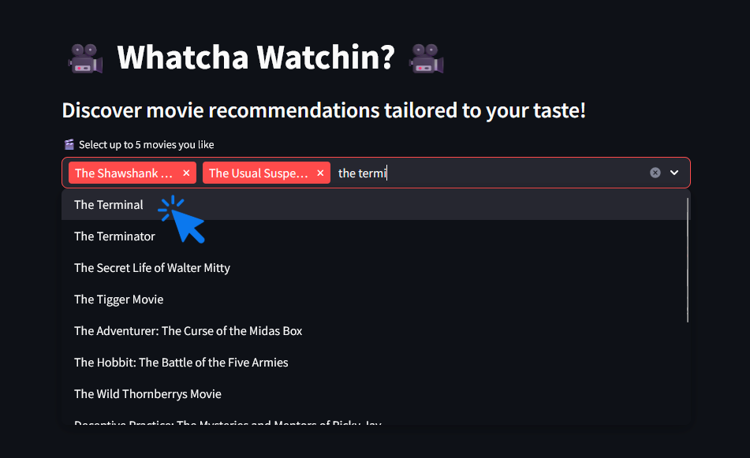

# Whatcha-Watchin 🎥
- https://whatcha-watchin.streamlit.app/

A Streamlit-based movie recommendation app that suggests highly rated movies tailored to your taste!

## How To Use

1. **Input some movies you like**
   - Users can input up to 5 movies they enjoy.
   - Suggestions are made based on this input.
     
     

2. **Click the button**
   - Click the "Get Suggestions" button.

     

3. **That's it!**
   - The top 10 highest-rated recommendations based on your input are display with ratings and posters.

     

## Available online at
- https://whatcha-watchin.streamlit.app/

## Setup and install offline

1. **Clone the repository**
   ```bash
   git clone https://github.com/miryarik/whatcha-watchin.git
   cd whatcha-watchin
   ```
   
2. **Install dependencies**
   - Make sure you have Python installed (>= 3.7).
   - Install required packages:
     
     ```bash
     pip install -r requirements.txt
     ```

3. **Run the Streamlit app**
   ```bash
   streamlit run app.py
   ```

Enjoy!
